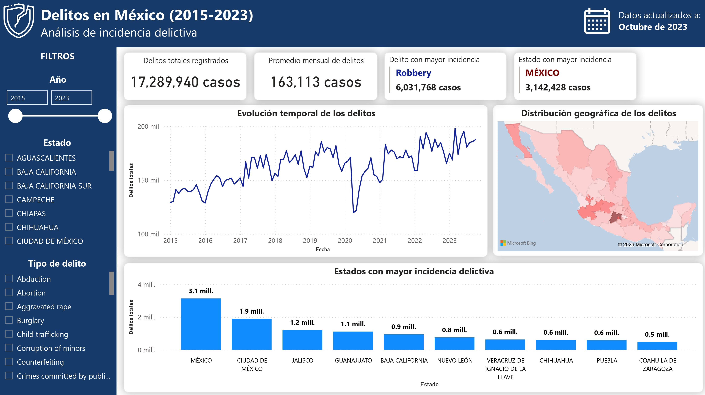
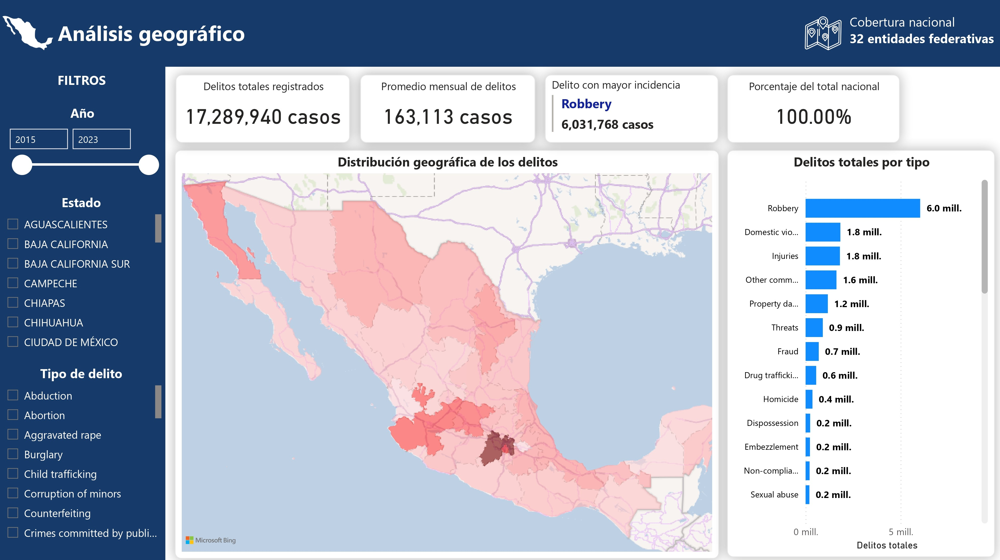
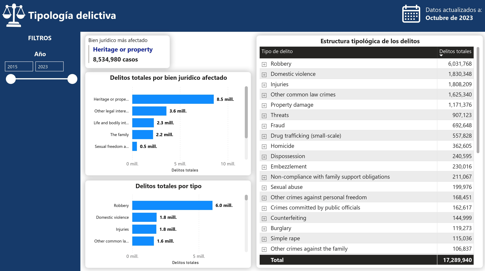
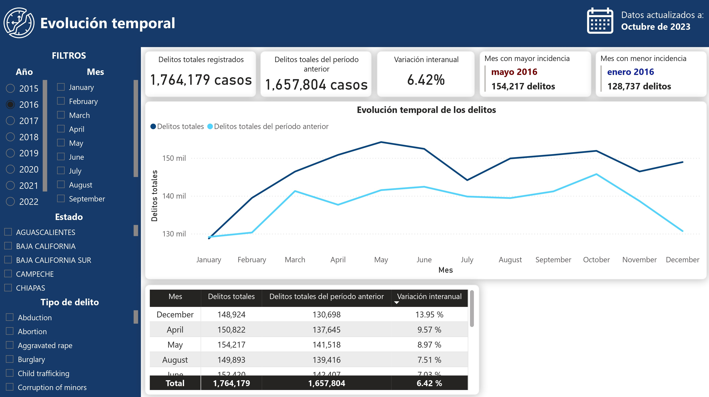

# **Análisis de la incidencia delictiva en México (2015-2023)**

Análisis de la incidencia delictiva registrada en México entre 2015 y 2023, desarrollado mediante MySQL y Power BI. El proyecto incluye ingesta, exploración y transformación de datos, modelado mediante un esquema estrella y un dashboard interactivo para analizar la distribución geográfica, temporal y tipológica de los delitos.

## Objetivo

El objetivo fue analizar la evolución y distribución de la incidencia delictiva registrada en México entre 2015 y 2023, identificando patrones geográficos, temporales y por tipo de delito, y desarrollar un modelo de datos que permitiera explorar estos patrones de manera interactiva.

## Dataset

El dataset utilizado contiene registros de incidencia delictiva en México correspondientes al periodo 2015-2023. La información comprende 332,416 registros y fue utilizada como fuente para el proceso de exploración, transformación y modelado de datos. Las variables originales son `anio`, `codigo_estado`, `estado`, `bien_juridico_afectado`, `tipo_delito`, `subtipo_delito`, `modalidad`, `mes` y `total_casos`. El periodo disponible abarca de **enero de 2015 a octubre de 2023**, por lo que los registros correspondientes a 2023 no representan un año completo. El dataset original no se incluye en el repositorio debido a su tamaño. Puede consultarse en la fuente de datos indicada al final del README.

## Proceso de análisis

1. **Ingesta y exploración:** carga del dataset en MySQL y análisis inicial de su estructura, calidad, distribución temporal, geográfica y tipológica.

2. **Limpieza y transformación:** preparación de los datos mediante la normalización de variables categóricas y la creación de identificadores y variables temporales necesarias para el análisis.

3. **Modelado de datos:** construcción de un modelo estrella en MySQL compuesto por una tabla de hechos (`fact_delitos`) y tres dimensiones (`dim_fecha`, `dim_estado` y `dim_delito`), estableciendo las relaciones necesarias para el análisis multidimensional.

4. **Análisis y visualización:** conexión del modelo con Power BI, definición de medidas DAX y construcción de un dashboard interactivo compuesto por cuatro páginas: **Overview**, **Análisis geográfico**, **Tipología delictiva** y **Evolución temporal**.

## Dashboard

El dashboard se divide en cuatro páginas principales:

### Overview

Presenta una visión general de la incidencia registrada durante el periodo analizado, incluyendo indicadores generales, distribución por entidad federativa y principales tipos de delito.

### Análisis geográfico

Permite explorar la distribución de los delitos entre las entidades federativas y analizar la incidencia por tipo de delito para el estado seleccionado.

### Tipología delictiva

Analiza la distribución de los casos según el bien jurídico afectado y el tipo de delito, incorporando una estructura jerárquica que permite explorar los diferentes niveles de clasificación.

### Evolución temporal

Permite analizar la evolución mensual de la incidencia registrada y comparar un periodo seleccionado con el periodo equivalente del año anterior.

## Principales hallazgos

* Se registraron 17,289,940 casos entre 2015 y octubre de 2023, con un promedio mensual de 163,113 casos.
* El Estado de México concentra el mayor número de casos registrados, con 3,142,428, seguido por la Ciudad de México, Jalisco y Guanajuato.
* La categoría *Heritage or property* concentra 8,534,980 casos, aproximadamente el 49.4% del total registrado.
* *Robbery* es el tipo de delito con mayor número de casos registrados, con 6,031,768, seguido por *Domestic violence* e *Injuries*.
* Los cuatro tipos de delito con mayor incidencia (*Robbery*, *Domestic violence*, *Injuries* y *Other common law crimes*) concentran aproximadamente el 65.4% del total registrado.

## Herramientas

* MySQL
* SQL
* Power BI
* DAX

## Archivos

* `sql/`: scripts SQL para la ingesta, exploración, limpieza, transformación y construcción del modelo estrella.
* `power_bi/`: archivo de Power BI con el dashboard interactivo.
* `images/`: capturas de las páginas del dashboard.
* `documentation/`: documentación completa del proyecto.

## Documentación

La documentación completa del proyecto incluye:

* Proceso de ingesta y exploración de los datos en MySQL.
* Limpieza y transformación de los datos.
* Construcción y validación del modelo estrella.
* Preparación del modelo para su análisis en Power BI.
* Definición de medidas DAX.
* Descripción de las cuatro páginas del dashboard.
* Principales hallazgos del análisis.

## Fuente de datos

[Mexican Crime Statistics: Comprehensive (2015-2023)](https://www.kaggle.com/datasets/elanderos/official-crime-stats-mexico-2015-2023), de e_landeros.
